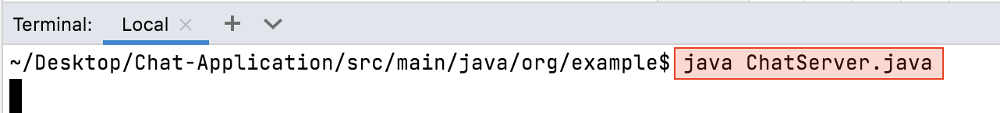
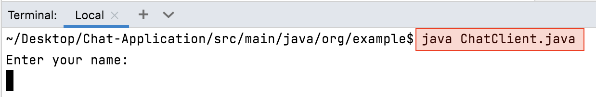
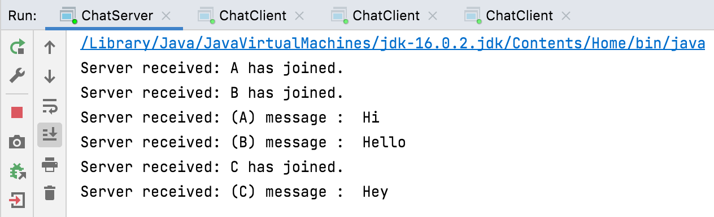
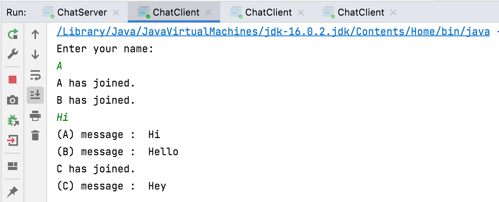
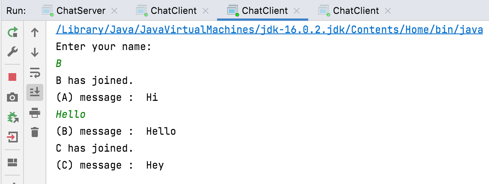
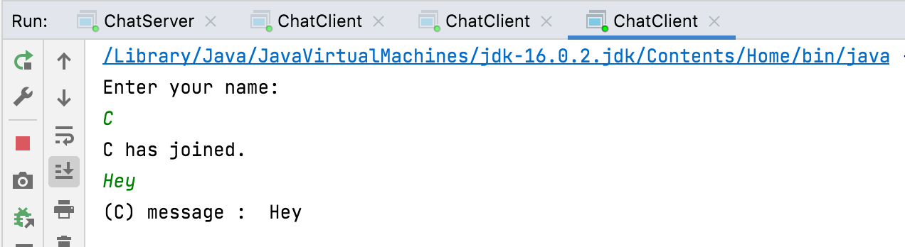

# Chat-Application
Simple Chat Application - using Socket Programming 

Run Instructions:

1. Run ChatServer.java 
    > java ChatServer.java
    

2. Run Multiple instances of ChatClient.java
    > java ChatClient.java
    

ScreenShots: 

Server Output:

Client 'A' Output:

Client 'B' Output:

Client 'C' Output:

